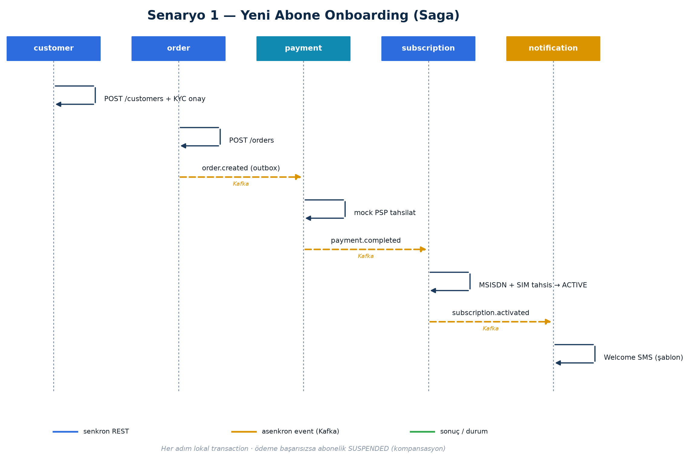
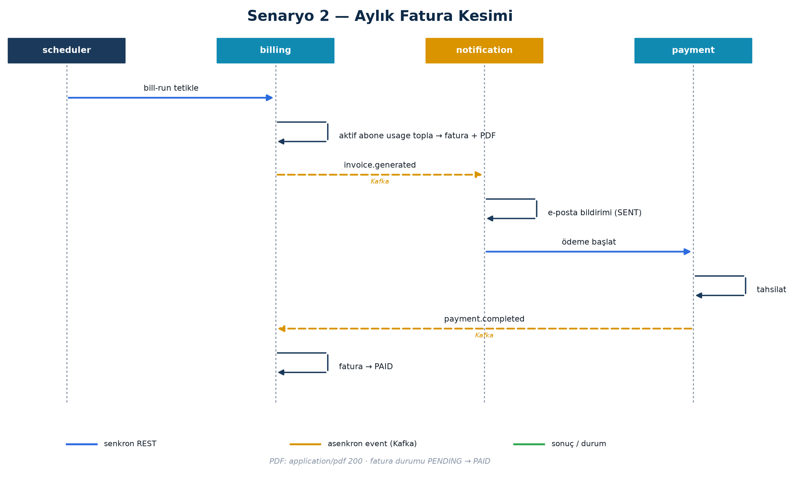
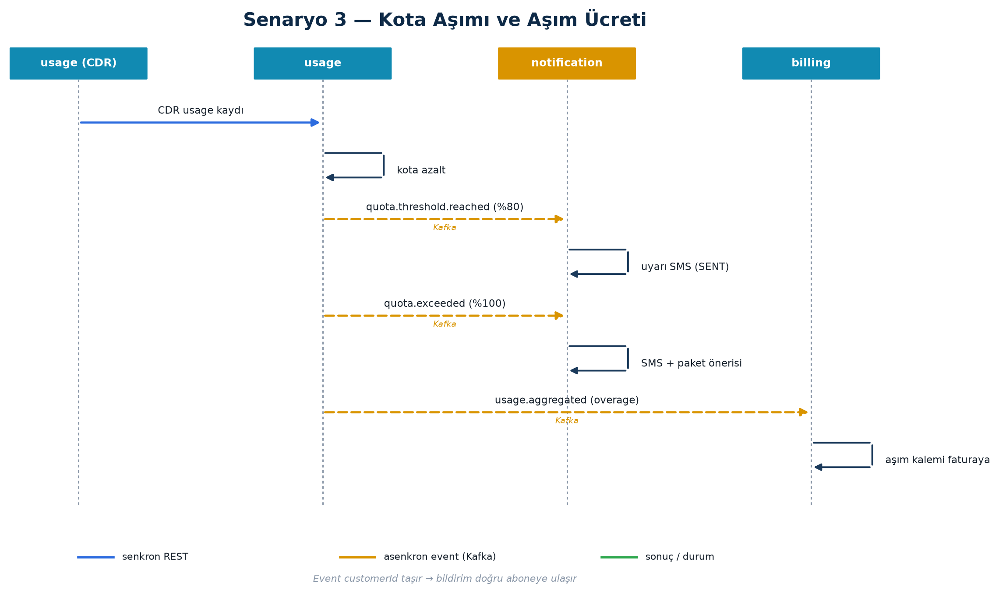
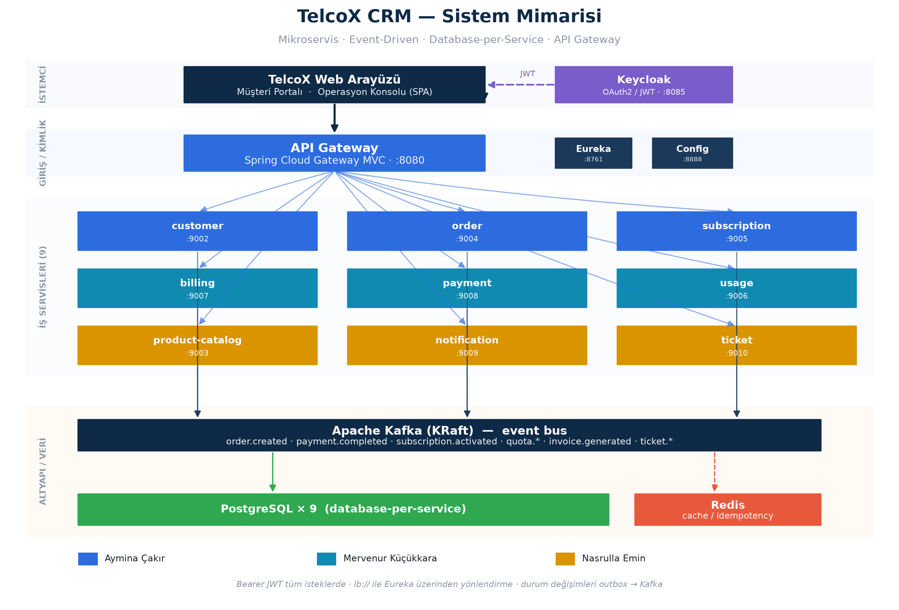
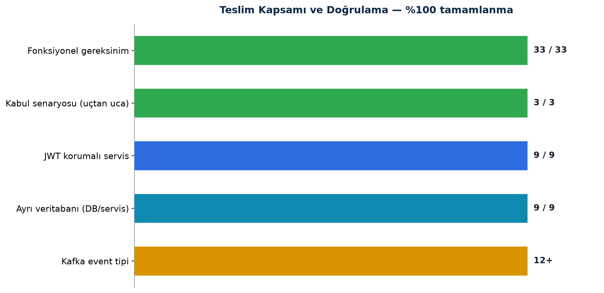
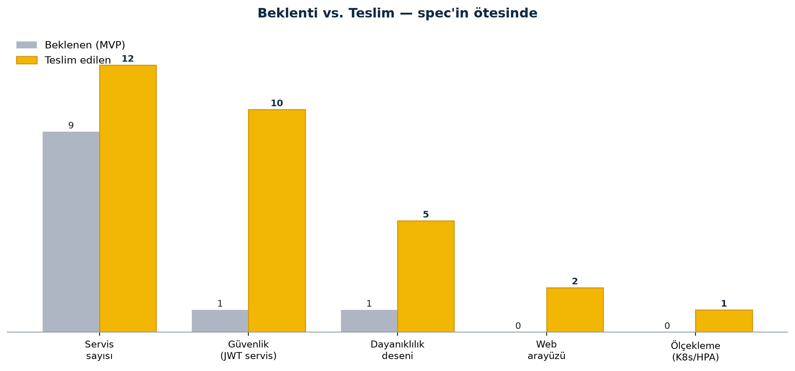
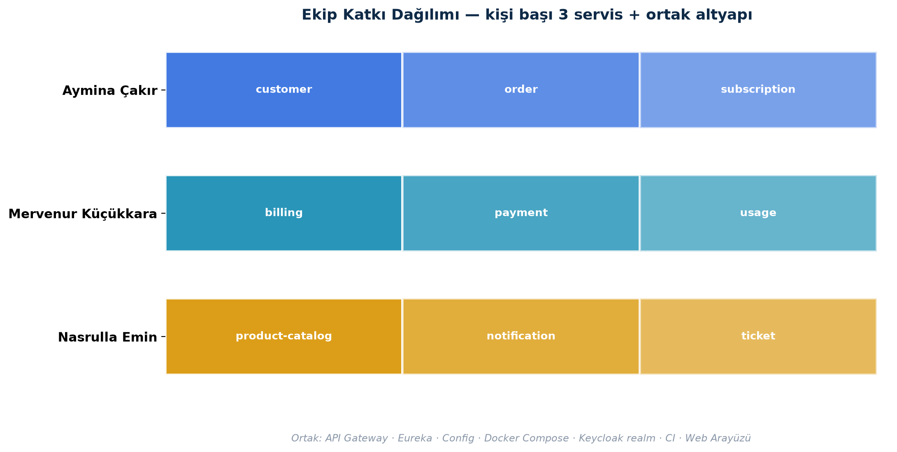

<div align="center">

# 📡 Turkcell Telco CRM Microservices

**Turkcell "Geleceği Yazanlar" Bootcamp — 2026**

*Hayali bir GSM operatörü TelcoX için mikroservis tabanlı CRM platformu*


**Aymina Çakır · Mervenur Küçükkara · Nasrulla Emin**

</div>

---

## 🧭 Değerlendirme Rehberi — *Neyin Nerede Olduğu*

> 👋 **Sayın hocam / jüri üyesi:** Bu bölüm projeyi **tek bakışta** değerlendirebilmeniz içindir. Detaylı proje raporu (grafikler, sistem mimarisi, uçtan uca senaryo diyagramları) ve tüm çalışmaların konumu aşağıdadır.

### 📄 Proje Teslim Raporu — *önce buraya bakın*

| Format | Bağlantı | İçerik |
|:---:|:---|:---|
| 📕 **PDF** | **[docs/PROJE_RAPORU.pdf](docs/PROJE_RAPORU.pdf)** | 15 sayfa · mimari + 3 senaryo diyagramı + grafikler + tablolar |
| 📘 **Word** | **[docs/PROJE_RAPORU.docx](docs/PROJE_RAPORU.docx)** | Düzenlenebilir sürüm (aynı içerik) |

### 🗂️ Proje Haritası — *ne, nerede*

| Ne | Açıklama | Konum |
|---|---|---|
| 📄 **Proje raporu** | Detaylı teslim raporu (PDF + Word) | [docs/PROJE_RAPORU.pdf](docs/PROJE_RAPORU.pdf) · [docs/PROJE_RAPORU.docx](docs/PROJE_RAPORU.docx) |
| 🎤 Sunum dokümanı | Jüri sunumu (17 bölüm, Markdown + Word) | [docs/SUNUM.md](docs/SUNUM.md) · [docs/SUNUM.docx](docs/SUNUM.docx) |
| 🧪 Kabul testleri | 3 senaryo — komut + beklenen sonuç | [docs/KABUL_TESTLERI.md](docs/KABUL_TESTLERI.md) |
| 📋 Gereksinimler | 33 fonksiyonel gereksinim (FR) | [docs/PROJE_GEREKSINIMLERI.md](docs/PROJE_GEREKSINIMLERI.md) |
| 📨 Event sözleşmeleri | Kafka event şemaları | [docs/event-contracts.md](docs/event-contracts.md) |
| 🖥️ Web arayüzü | Müşteri portalı + operasyon konsolu | [gateway_server/…/static](gateway_server/src/main/resources/static) |
| 🤖 CI / CD | GitHub Actions — her push'ta build + test | [.github/workflows/ci.yml](.github/workflows/ci.yml) |
| ☸️ Kubernetes + HPA | Ölçekleme örneği | [k8s/](k8s) |
| ▶️ Çalıştırma scriptleri | run-all · stop-all · status · seed | [scripts/](scripts) |
| 🧩 Mikroservisler | 9 iş servisi (sahiplerine göre) | [aşağıdaki tablo](#-mikroservisler) |

> **Port haritası:** gateway `8080` · eureka `8761` · config `8888` · keycloak `8085` · customer `9002` · product-catalog `9003` · order `9004` · subscription `9005` · usage `9006` · billing `9007` · payment `9008` · notification `9009` · ticket `9010`

---

## 📋 İçindekiler

- [Değerlendirme Rehberi (neyin nerede)](#-değerlendirme-rehberi--neyin-nerede-olduğu)
- [Proje Hakkında](#-proje-hakkında)
- [MVP Senaryoları](#-mvp-senaryoları)
- [Mimari](#-mimari)
- [Mikroservisler](#-mikroservisler)
- [Veri Modeli](#-veri-modeli)
- [Tech Stack](#-tech-stack)
- [Kurulum](#-kurulum)
- [Dokümantasyon](#-dokümantasyon)
- [Kilit Mimari Desenler](#-kilit-mimari-desenler)
- [Web Arayüzü — TelcoX](#-web-arayüzü--telcox-gerçek-backende-bağlı)
- [Kabul Senaryoları](#-kabul-senaryoları--uçtan-uca-doğrulandı)
- [Beklentinin Ötesi](#-beklentinin-ötesi-specin-üstüne-kattıklarımız)
- [ER Diyagramları](#-er-diyagramları)
- [Proje Durumu](#-proje-durumu)
- [Ekip ve Katkılar](#-ekip-ve-katkılar)

---

## 📖 Proje Hakkında

TelcoX CRM, bir GSM operatörünün tüm iş süreçlerini yöneten **mikroservis tabanlı** kurumsal bir CRM platformudur. Müşteri kaydından faturaya, ödemeden bildirimlere kadar uçtan uca akışı kapsar.

**Temel prensipler:**
- 🔒 **Database per service** — Her mikroservis yalnızca kendi veritabanına erişir
- 🔗 **Loose coupling** — Servisler arası doğrudan FK kullanılmaz; ID referansı tutulur
- 📨 **Event-driven** — Servisler arası iletişim Kafka üzerinden planlanmıştır
- 🏗️ **Multi-module Maven** — Tüm servisler tek repo, ortak parent pom

> 📄 Detaylı analiz ve tasarım dokümanı: [**Proje Gereksinimleri**](docs/PROJE_GEREKSINIMLERI.md) · Demo rehberi: [**TelcoX Web Arayüzü**](docs/DEMO.md) · Event sözleşmeleri: [**event-contracts.md**](docs/event-contracts.md)

---

## 🎯 MVP Senaryoları — *Uçtan Uca İş Akışları*

Üç kabul senaryosunun da sekans diyagramları aşağıdadır; hepsi **gerçek servisler üzerinde çalıştırılıp doğrulandı** (bkz. [Kabul Senaryoları](#-kabul-senaryoları--uçtan-uca-doğrulandı)).

<details open>
<summary><b>1️⃣ Yeni Abone Onboarding (Saga)</b> — müşteri → sipariş → ödeme → abonelik → bildirim</summary>

<div align="center"></div>
</details>

<details>
<summary><b>2️⃣ Aylık Fatura Kesimi</b> — bill-run → fatura + PDF → bildirim → ödeme → PAID</summary>

<div align="center"></div>
</details>

<details>
<summary><b>3️⃣ Kota Aşımı ve Aşım Ücreti</b> — CDR → %80/%100 eşik SMS → overage faturaya</summary>

<div align="center"></div>
</details>

---

## 🏗️ Mimari

<div align="center">



*İstemci → API Gateway (JWT) → 9 iş servisi → Kafka / PostgreSQL×9 / Redis. Servisler sahiplerine göre renklendirilmiştir.*

</div>

### Klasör yapısı

```
turkcell-telco-crm-microservices/
│
├── 🌐 gateway_server/            Port: 8080  │  API Gateway + TelcoX web arayüzü
├── 🔍 eureka_server/             Port: 8761  │  Servis keşfi
├── ⚙️  config-server/             Port: 8888  │  Merkezi konfigürasyon
│
├── 📦 customer-service/          Port: 9002  │  DB: customer_db
├── 📦 product-catalog-service/   Port: 9003  │  DB: product_catalog_db
├── 📦 order-service/             Port: 9004  │  DB: order_db
├── 📦 subscription-service/      Port: 9005  │  DB: subscription_db
├── 📦 usage-service/             Port: 9006  │  DB: usage_db
├── 📦 billing-service/           Port: 9007  │  DB: billing_db
├── 📦 payment-service/           Port: 9008  │  DB: payment_db
├── 📦 notification-service/      Port: 9009  │  DB: notification_db
├── 📦 ticket-service/            Port: 9010  │  DB: ticket_db
│
├── 🐳 docker/docker-compose.yml  Kafka · PostgreSQL × 9 · Redis · Keycloak
└── 📄 pom.xml                    ← Root parent pom
```

---

## 🧩 Mikroservisler

| # | Servis | Port | Veritabanı | Sorumlu | Açıklama |
|---|---|---|---|---|---|
| 1 | customer-service | 9002 | customer_db | Aymina | Müşteri kaydı, adres, KYC belgesi |
| 2 | product-catalog-service | 9003 | product_catalog_db | Nasrulla | Tarife, ek paket kataloğu |
| 3 | order-service | 9004 | order_db | Aymina | Sipariş yönetimi, Saga pattern |
| 4 | subscription-service | 9005 | subscription_db | Aymina | Abonelik, MSISDN havuzu, SIM kart |
| 5 | usage-service | 9006 | usage_db | Mervenur | Kota takibi, CDR kullanım kayıtları |
| 6 | billing-service | 9007 | billing_db | Mervenur | Fatura üretimi, fatura döngüsü |
| 7 | payment-service | 9008 | payment_db | Mervenur | Ödeme, ödeme girişimleri |
| 8 | notification-service | 9009 | notification_db | Nasrulla | SMS, e-posta, push bildirimleri |
| 9 | ticket-service | 9010 | ticket_db | Nasrulla | Müşteri talep ve şikayetleri |

---

## 🗄️ Veri Modeli

Her servisin entity'leri:

<details>
<summary><b>customer-service</b></summary>

| Entity | Açıklama |
|---|---|
| Customer | Müşteri bilgileri (INDIVIDUAL / CORPORATE) |
| Address | Müşteri adresleri |
| Document | KYC belgeleri (ID_CARD / PASSPORT) |

</details>

<details>
<summary><b>product-catalog-service</b></summary>

| Entity | Açıklama |
|---|---|
| Tariff | Tarife tanımları (POSTPAID / PREPAID) |
| Addon | Ek paketler (DATA / SMS / MINUTES / VAS) |
| TariffAddon | Tarife-Ek paket ilişkisi (many-to-many) |

</details>

<details>
<summary><b>order-service</b></summary>

| Entity | Açıklama |
|---|---|
| Order | Sipariş başlığı |
| OrderItem | Sipariş kalemleri |
| SagaState | Saga adım durumu |

</details>

<details>
<summary><b>subscription-service</b></summary>

| Entity | Açıklama |
|---|---|
| Subscription | Abonelik (ACTIVE / SUSPENDED / TERMINATED) |
| MsisdnPool | MSISDN havuzu (FREE / RESERVED / ALLOCATED) |
| SimCard | SIM kart |

</details>

<details>
<summary><b>usage-service</b></summary>

| Entity | Açıklama |
|---|---|
| Quota | Dönemlik kota bilgisi |
| UsageRecord | CDR kullanım kayıtları (VOICE / SMS / DATA) |

</details>

<details>
<summary><b>billing-service</b></summary>

| Entity | Açıklama |
|---|---|
| Invoice | Fatura başlığı |
| InvoiceLine | Fatura kalemleri |
| BillCycle | Fatura döngüsü |

</details>

<details>
<summary><b>payment-service</b></summary>

| Entity | Açıklama |
|---|---|
| Payment | Ödeme kaydı |
| PaymentAttempt | Ödeme girişimleri |

</details>

<details>
<summary><b>notification-service</b></summary>

| Entity | Açıklama |
|---|---|
| NotificationTemplate | Bildirim şablonları |
| Notification | Gönderilen bildirimler |

</details>

<details>
<summary><b>ticket-service</b></summary>

| Entity | Açıklama |
|---|---|
| Ticket | Müşteri talep/şikayeti |
| TicketComment | Yorum ve yanıtlar |

</details>

---

## 🛠️ Tech Stack

| Kategori | Teknoloji | Durum |
|---|---|---|
| Dil | Java 21 | ✅ |
| Framework | Spring Boot 3.4 | ✅ |
| Cloud | Spring Cloud Gateway, Config, Eureka, OpenFeign | ✅ |
| ORM | Spring Data JPA / Hibernate | ✅ |
| Veritabanı | PostgreSQL 17 | ✅ |
| Migration | Flyway | ✅ |
| Mesajlaşma | Apache Kafka 4.2 | ✅ |
| Cache / Rate limit | Redis 7 | ✅ |
| Auth | Keycloak (OAuth2/JWT) | ✅ |
| Build | Maven (Multi-module) | ✅ |
| Container | Docker Compose | ✅ |
| CI | GitHub Actions | ✅ |

---

## 🚀 Kurulum

### Gereksinimler

- Java 21+
- Maven 3.9+
- Docker Desktop

### Hızlı Başlangıç

```bash
git clone https://github.com/ayminacakir/turkcell-telco-crm-microservices
cd turkcell-telco-crm-microservices

# 1) Altyapı (Kafka, PostgreSQL × 9, Redis, Keycloak — Keycloak realm otomatik import)
cd docker && docker compose up -d && cd ..

# 2) Tüm servisleri tek komutla başlat (config → eureka → gateway → 9 iş servisi)
./scripts/run-all.sh          # ~1-2 dk;  ./scripts/status.sh  ile 12/12 bekle

# 3) Tutarlı demo verisi (abonelik, kota, faturalar, talepler, SIM havuzu)
./scripts/seed-demo-data.sh

# 4) Web arayüzü
# http://localhost:8080/TelcoX.html    (Müşteri: elif.aydin · Yönetici: ops · şifre: telcox123)
```

**Yardımcı scriptler:** `run-all.sh` (hepsini başlat) · `stop-all.sh` (durdur) · `status.sh` (12/12 sağlık) · `seed-demo-data.sh` (demo veri).

- 📘 Demo rehberi, kullanıcılar, sorun giderme → **[docs/DEMO.md](docs/DEMO.md)**
- 🧪 3 kabul senaryosunu uçtan uca çalıştırma (komut + beklenen sonuç) → **[docs/KABUL_TESTLERI.md](docs/KABUL_TESTLERI.md)**
- Swagger UI her serviste `/swagger-ui.html` (ör. `http://localhost:9002/swagger-ui.html`)

---

## 📚 Dokümantasyon

| Doküman | Açıklama |
|---|---|
| [docs/PROJE_RAPORU.pdf](docs/PROJE_RAPORU.pdf) · [PROJE_RAPORU.docx](docs/PROJE_RAPORU.docx) | 📄 **Proje teslim raporu** (PDF + Word) — grafikler, sistem mimarisi, 3 senaryo diyagramı, tablolar |
| [docs/SUNUM.md](docs/SUNUM.md) · [SUNUM.docx](docs/SUNUM.docx) | 🎤 **Jüri sunum dokümanı** (Markdown + Word) — mimari, desenler, akışlar, demo, katkılar |
| [docs/PROJE_GEREKSINIMLERI.md](docs/PROJE_GEREKSINIMLERI.md) | MVP analiz ve tasarım (33 FR) |
| [docs/DEMO.md](docs/DEMO.md) | TelcoX web arayüzü demo rehberi |
| [docs/KABUL_TESTLERI.md](docs/KABUL_TESTLERI.md) | 3 kabul senaryosu — uçtan uca test komutları |
| [docs/event-contracts.md](docs/event-contracts.md) | Kafka event sözleşmeleri |
| [docs/YONETICI_SUNUM_RAPORU.md](docs/YONETICI_SUNUM_RAPORU.md) | Yönetici sunum raporu |
| [k8s/product-catalog/README.md](k8s/product-catalog/README.md) | Kubernetes örnek deployment |
| Servis README'leri | Her servis klasöründe (`billing-service/README.md` vb.) |

---

## 📊 ER Diyagramları

### Genel ER Diyagramı (Unified)

Tüm servislerin tek bir yapı olarak modellendiği genel ER diyagramı — ilk tasarım aşamasında oluşturulmuştur.


---

### Servis Bazlı ER Diyagramları

Her mikroservisin ER diyagramı ilgili servis klasöründe PNG olarak bulunmaktadır.
Diyagramlar [dbdiagram.io](https://dbdiagram.io) üzerinde **database per service** prensibiyle ayrı ayrı oluşturulmuştur.

| Servis | Diyagram |
|---|---|
| customer-service | [customer-service-ER.png](customer-service/customer-service-ER.png) |
| product-catalog-service | [product-catalog-service-er.png](product-catalog-service/product-catalog-service-er.png) |
| order-service | [order-service-ER.png](order-service/order-service-ER.png) |
| subscription-service | [subscription-service-ER.png](subscription-service/subscription-service-ER.png) |
| billing-service | [Billing_Service-ER.png](billing-service/Billing_Service-ER.png) |
| payment-service | [Payment_Service-ER.png](payment-service/Payment_Service-ER.png) |
| usage-service | [Usage_Service-ER.png](usage-service/Usage_Service-ER.png) |
| notification-service | [notification-service-er.png](notification-service/notification-service-er.png) |
| ticket-service | [ticket-service-er.png](ticket-service/ticket-service-er.png) |

---

## 🔑 Kilit Mimari Desenler

Proje, "gerçek dünya" telekom yükünü taşıyacak dağıtık sistem desenleriyle kuruldu:

| Desen | Nerede | Ne sağlar |
|---|---|---|
| **Database-per-service** | 9 ayrı PostgreSQL şeması | Servisler birbirinin tablosuna dokunamaz; gevşek bağ |
| **Transactional Outbox** | order, subscription, usage, billing, payment, ticket | DB commit'i ile Kafka publish'i **atomik** — event kaybı yok; FAILED event retry ile yeniden yayınlanır |
| **Saga (orchestration)** | order-service | Sipariş→Ödeme→Abonelik dağıtık işlemi; başarısızlıkta kompansasyon (abonelik askıya alma) |
| **Idempotency** | payment & subscription & usage consumer'ları | `processed_events` tablosu + Idempotency-Key → aynı event iki kez işlenmez |
| **Cache-aside (Redis)** | product-catalog tarife okuma | Sık okunan katalog Redis'te; JavaTimeModule ile LocalDate serileştirme |
| **Circuit Breaker / Retry** | Resilience4j (servisler arası Feign) | Hata oranı eşiği aşılınca çağrı kesilir, sistem çökmez |
| **CQRS-benzeri okuma modeli** | pagination'lı liste uçları | Yazma ve okuma sorumluluğu ayrık; `PageResponse` sözleşmesi |
| **API Gateway + BFF** | gateway_server (Spring Cloud Gateway MVC) | Tek giriş, JWT doğrulama, `lb://` ile Eureka üzerinden yönlendirme |

📄 Event akış sözleşmeleri: **[docs/event-contracts.md](docs/event-contracts.md)**

---

## 🖥️ Web Arayüzü — TelcoX (gerçek backend'e bağlı)

Arayüz gateway'in içinden servis edilir (tek origin → CORS yok) ve **gerçek servislere** bağlıdır: giriş Keycloak'tan gerçek JWT alır, tüm ekranlar canlı API verisi gösterir.

**👤 Müşteri Portalı** (`elif.aydin`) — telefon / ad / kullanıcı adı ile giriş
- **Ana Sayfa**: gerçek tarife, güncel fatura, açık talep, **kota çubukları** (gerçek usage)
- **Paket Değiştir**: gerçek tarife kataloğundan bir pakete geçince **abonelik + kota gerçekten güncellenir** (`PATCH tariff → PUT quota`), çubuklar yenilenir
- **Kullanımım**: gerçek kota + **tarih aralığı sorgusu** (gerçek CDR history)
- **Faturalarım**: gerçek faturalar + **Detay** (kalemler, ÖİV %10 + KDV %20 dökümü) + **PDF**
- **Taleplerim**: konu + kategori/alt kategori + öncelik → gerçek `POST /tickets`
- **Profilim**: gerçek müşteri/adres/iletişim + düzenleme
- **Dijital ürünler & satın alma geçmişi**, kota %20 altına düşünce **otomatik paket önerisi**

**🛠️ Operasyon Konsolu** (`ops`) — sol menülü SPA, dark mode
- **Dashboard / Müşteriler / Ürünler / Siparişler / Faturalama / Ticket Center**: gerçek API verisi
- **Ticket Center**: tüm müşterilerin talepleri (portaldan açılan dahil) + **otomatik atanan ekip** + İşleme Al / Çöz (gerçek PATCH/POST)
- **Monitoring**: gerçek servis sağlığı (`/ops/health` aggregatörü) + aktif abone/pod/CPU
- **Logs / Alarm / Incident**: canlı akış (servis UP/DOWN durumu gerçektir)

> Canlı RBAC: `ops` = ADMIN (tarife oluştur, bill-run, KYC onayı çalışır) · `elif.aydin` = USER (admin uçları 403 alır).

---

## 🧪 Kabul Senaryoları — Uçtan Uca **Doğrulandı**

Dokümanın Bölüm 14'teki 3 kabul senaryosu gerçek servisler üzerinde uçtan uca çalıştırıldı ve **hepsi geçti** (adım adım komutlar: **[docs/KABUL_TESTLERI.md](docs/KABUL_TESTLERI.md)**):

| Senaryo | Akış | Sonuç |
|---|---|---|
| **14.1 Onboarding** | müşteri → KYC onay → sipariş → ödeme → abonelik | ✅ Abonelik **ACTIVE** + MSISDN atandı + welcome SMS |
| **14.2 Aylık Fatura** | bill-run → fatura + PDF → `InvoiceGenerated` → ödeme | ✅ PDF **200/application-pdf** + e-posta SENT + fatura **PAID** |
| **14.3 Kota Aşımı** | CDR usage → %80 uyarı → %100 aşım → overage | ✅ **%80 + %100 SMS** + overage billing'e (`UsageAggregated`) |

<div align="center">



</div>

---

## ⭐ Beklentinin Ötesi (Spec'in Üstüne Kattıklarımız)

<div align="center">



</div>

MVP'nin 33 fonksiyonel gereksinimi tamamlandı; ek olarak jüriye "production-grade" olgunluk göstermek için:

- 🔐 **Uçtan uca güvenlik**: gateway + **9 servisin tamamında** JWT resource-server; Keycloak realm otomatik import; canlı RBAC
- 🖥️ **Gerçek web arayüzü**: son kullanıcı portalı + operasyon konsolu — mock değil, gerçek API'ye bağlı
- 🔁 **Outbox FAILED-retry** ve **idempotent consumer**'lar — event kaybı / çift işleme yok
- 🧾 **PDF fatura üretimi** + ÖİV/KDV vergi dökümü
- ⚡ **Redis cache** (katalog) + **pagination** (liste uçları) — ölçeklenebilir okuma
- 🛡️ **Resilience4j** circuit breaker / retry; **PII şifreleme** (müşteri kimlik verisi)
- ☸️ **Kubernetes** örneği: Deployment + **HPA** (yatay ölçekleme) + README (`k8s/product-catalog/`)
- 🤖 **GitHub Actions CI**: her push'ta build + test
- 🌐 **Eureka localhost kaydı**, tek-komut başlatma scriptleri, tutarlı seed verisi

---

## ✅ Proje Durumu

| Alan | Durum |
|---|---|
| 9 iş mikroservisi + gateway, Eureka, config-server | ✅ |
| 33 fonksiyonel gereksinim (MVP) | ✅ |
| Database-per-service + Flyway migration | ✅ |
| Transactional Outbox + FAILED retry | ✅ |
| Saga orchestration (order-service) | ✅ |
| Kafka event-driven entegrasyon | ✅ |
| **JWT güvenlik (gateway + 9 servisin tamamı)** | ✅ |
| İdempotency + Redis cache + pagination | ✅ |
| Uçtan uca onboarding / fatura / kota senaryoları (test edildi) | ✅ |
| TelcoX web arayüzü (portal + ops konsolu, gerçek veri) | ✅ |
| GitHub Actions CI · Kubernetes + HPA örneği | ✅ |
| Docker Compose altyapısı (Keycloak realm import) | ✅ |

> **Not:** CPU/RAM/pod/HPA görselleri Prometheus olmadığı için simülasyondur; **servis UP/DOWN durumu ise gerçektir** (`/ops/health` sunucu tarafında tüm servislerin `/actuator/health`'ini yoklar). Tam metrik entegrasyonu (Prometheus/Grafana) gelecek çalışmadır.

---

## 👥 Ekip ve Katkılar

Proje 3 kişilik ekip tarafından geliştirildi; her geliştirici 3 mikroservisten sorumlu, altyapı (gateway, Eureka, config-server, Docker, CI, web arayüzü) ortak çalışmayla tamamlandı.

<div align="center">



</div>


| Geliştirici | Sorumlu Servisler | Öne çıkan katkılar |
|---|---|---|
| **Aymina Çakır** | customer · order · subscription | Müşteri CRUD + KYC + **PII şifreleme**; abonelik lifecycle + MSISDN/SIM havuzu; **Saga orchestration**, productCode migration, Feign token interceptor |
| **Mervenur Küçükkara** | billing · payment · usage | Fatura üretimi + bill-run + **PDF**; mock PSP + retry + **idempotency** + cüzdan + Flyway migration; kota takibi + CDR tüketimi + **aşım bildirimleri** |
| **Nasrulla Emin** | product-catalog · notification · ticket | Tarife/addon katalog + **versiyonlama** + **Redis cache**; Kafka-driven bildirim + şablon yönetimi; destek talepleri + **SLA + otomatik ekip atama** |

**Ortak:** API Gateway, Eureka, config-server, Docker Compose, GitHub Actions CI, Keycloak realm, TelcoX web arayüzü (müşteri portalı + operasyon konsolu), kabul testleri.

---

<div align="center">

*Turkcell Geleceği Yazanlar Bootcamp — 2026*

</div>
