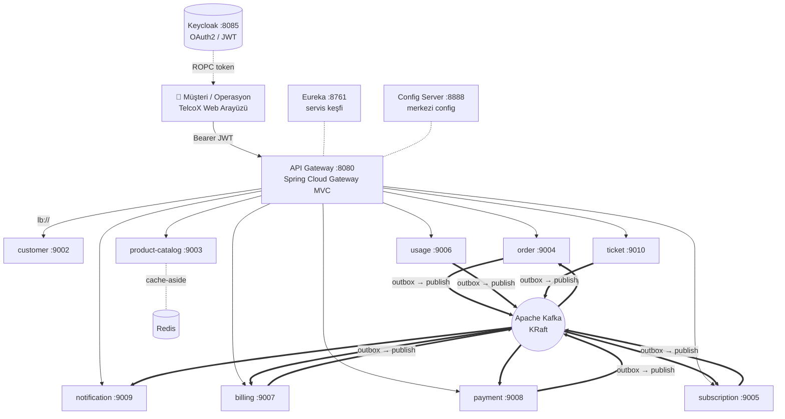
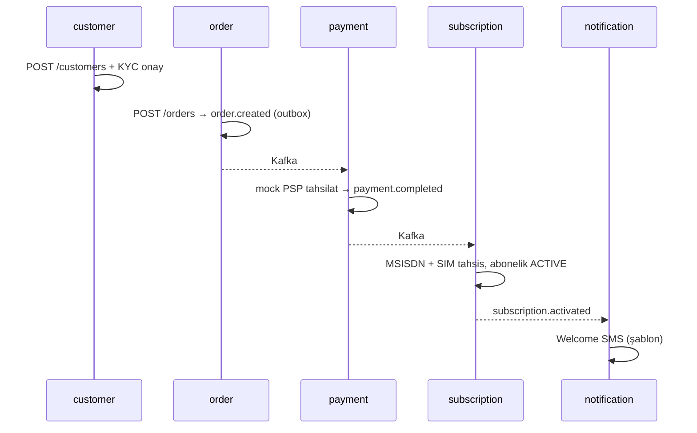
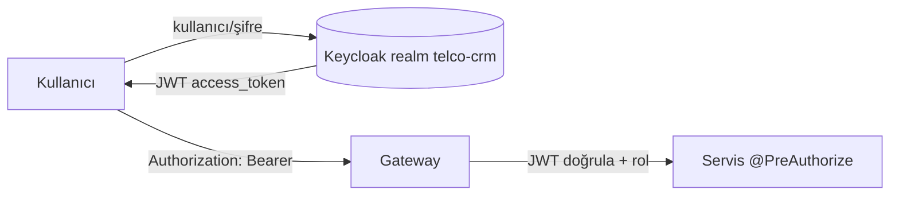

<div align="center">

# 🎤 TelcoX CRM — Jüri Sunum Dokümanı

### Turkcell "Geleceği Yazanlar" Bootcamp — 2026
## Mikroservis Tabanlı Telekom CRM Platformu

**Ekip:** Aymina Çakır · Mervenur Küçükkara · Nasrulla Emin
**Repo:** github.com/ayminacakir/turkcell-telco-crm-microservices

</div>

---

> **Bu dokümanı nasıl okumalı?**
> Terminalden `less docs/SUNUM.md` ya da GitHub'da açabilirsiniz (mermaid diyagramları
> GitHub'da otomatik çizilir). Word (.docx) sürümü `docs/SUNUM.docx` altındadır.
> Sunumu 3 katmanda kurguladık: **(1) Ne yaptık** · **(2) Nasıl yaptık (mimari/desen)** ·
> **(3) Kanıt (test + demo)**.

---

## 📑 İçindekiler

1. [Yönetici Özeti](#1-yönetici-özeti)
2. [Problem, Vizyon ve Hedef](#2-problem-vizyon-ve-hedef)
3. [Neden Mikroservis? Tasarım Felsefesi](#3-neden-mikroservis-tasarım-felsefesi)
4. [Sistem Mimarisi](#4-sistem-mimarisi)
5. [Teknoloji Yığını (ve neden seçtik)](#5-teknoloji-yığını-ve-neden-seçtik)
6. [Mikroservisler — Servis Servis Derinlik](#6-mikroservisler--servis-servis-derinlik)
7. [Kilit Mimari Desenler (kod ile)](#7-kilit-mimari-desenler-kod-ile)
8. [Uçtan Uca İş Akışları (3 senaryo)](#8-uçtan-uca-i̇ş-akışları-3-senaryo)
9. [Güvenlik Mimarisi](#9-güvenlik-mimarisi)
10. [Web Arayüzü — TelcoX](#10-web-arayüzü--telcox)
11. [Kalite: Test, CI, Kabul Kanıtları](#11-kalite-test-ci-kabul-kanıtları)
12. [Karşılaştığımız Gerçek Problemler ve Çözümleri](#12-karşılaştığımız-gerçek-problemler-ve-çözümleri)
13. [DevOps & Ölçeklenebilirlik](#13-devops--ölçeklenebilirlik)
14. [Beklenti vs. Teslim](#14-beklenti-vs-teslim)
15. [Ekip ve Katkılar](#15-ekip-ve-katkılar)
16. [Öğrenilenler ve Gelecek Çalışma](#16-öğrenilenler-ve-gelecek-çalışma)
17. [Hızlı Referans (komutlar & portlar)](#17-hızlı-referans)

---

## 1. Yönetici Özeti

TelcoX, hayali bir GSM operatörünün **müşteri yaşam döngüsünü uçtan uca** dijitalleştiren
bir mikroservis platformudur. Bir abonenin **kaydından (KYC)** → **siparişe** → **ödemeye**
→ **abonelik aktivasyonuna** → **kullanım (CDR) takibine** → **faturaya** → **destek
taleplerine** kadar tüm süreç, **9 iş servisi** ve **3 altyapı servisi** üzerinde,
**event-driven** ve **database-per-service** prensipleriyle akar.

**Rakamlarla:**

| Metrik | Değer |
|---|---|
| Mikroservis | **12** (9 iş + gateway + Eureka + config) |
| Ayrı veritabanı | **9** (database-per-service) |
| Kafka topic / event tipi | 12+ (order.created, payment.completed, subscription.activated, quota.threshold.reached, invoice.generated, …) |
| Fonksiyonel gereksinim | **33 / 33 tamamlandı** |
| Kabul senaryosu | **3 / 3 uçtan uca doğrulandı** ✅ |
| JWT korumalı servis | gateway + **9 servisin tamamı** |
| Ekip | 3 geliştirici · her biri 3 servis + ortak altyapı |

**Tek cümlede farkımız:** Ödev "çalışan bir MVP" isterken biz **production-grade** bir sistem
kurduk — gerçek web arayüzü, uçtan uca güvenlik, dağıtık dayanıklılık desenleri (outbox,
saga, idempotency, circuit breaker), CI ve Kubernetes ölçekleme örneğiyle.

---

## 2. Problem, Vizyon ve Hedef

**Problem:** Operatör "TelcoX", mevcut **monolit** CRM'ini parça parça mikroservislere
taşımak istiyor. Monolit; tek DB, tek deploy, tek hata noktası demek — bir modül çökünce
tüm sistem düşüyor, bir ekip diğerini bekliyor, ölçekleme "hepsi ya da hiçbiri".

**Vizyon:** Abonenin tüm temas noktalarını (sales, service, billing, support) **bağımsız
ölçeklenebilen, bağımsız deploy edilebilen** servislere ayırmak; servisler arası bağı
**event** ile gevşetmek; her domaini **kendi verisinin sahibi** yapmak.

**Bootcamp hedefleri (hepsi karşılandı):** DDD ile bounded context, Spring Boot 3
production servisleri, Spring Cloud topolojisi, Kafka event-driven entegrasyon, REST+OpenAPI
sözleşmeleri, database-per-service, Redis cache/idempotency, Docker+Kubernetes, JWT güvenlik,
Resilience4j, CI/CD.

---

## 3. Neden Mikroservis? Tasarım Felsefesi

| İlke | Ne demek | Bizde uygulaması |
|---|---|---|
| **Database per service** | Her servis yalnız kendi verisinin sahibi | 9 ayrı PostgreSQL şeması; servisler arası **FK yok**, sadece ID referansı |
| **Loose coupling** | Servisler birbirine sıkı bağlı olmamalı | Asıl entegrasyon **asenkron Kafka**; senkron REST yalnız zorunlu yerde (Feign) |
| **Bounded context (DDD)** | Her modelin net bir geçerlilik sınırı | 9 net domain: Müşteri, Katalog, Sipariş, Abonelik, Kullanım, Fatura, Ödeme, Bildirim, Talep |
| **Atomicity** | "DB yaz + event at" bölünememeli | **Transactional Outbox**: ikisi tek transaction'da |
| **Idempotency** | Aynı iş iki kez yapılınca sonuç değişmemeli | `processed_events` + Idempotency-Key |
| **Resilience** | Bir servis çökse sistem ayakta kalmalı | Resilience4j circuit breaker/retry, outbox retry |

> **Neden doğrudan FK yerine ID referansı?** Çünkü FK iki servisi aynı DB'ye zincirler ve
> bağımsız deploy/ölçeklemeyi öldürür. Tutarlılığı DB'ye değil, **event'lere** emanet ettik.

---

## 4. Sistem Mimarisi



**Nasıl çalışır (özet):**
1. Kullanıcı, tarayıcıdan **Keycloak'tan JWT** alır (ROPC). Web arayüzü gateway'in
   `static/` klasöründen servis edilir → **tek origin, CORS derdi yok**.
2. Her API isteği gateway'e gelir; gateway **JWT'yi doğrular**, `lb://servis-adı` ile
   **Eureka üzerinden** ilgili servise yönlendirir (client-side load balancing).
3. Servisler iş verisini işler ve durum değişimlerini **outbox** üzerinden **Kafka'ya**
   yayınlar. İlgili servisler bu event'leri **asenkron** tüketir (ör. ödeme tamamlanınca
   abonelik aktive olur, bildirim gider).
4. **Config-server** ortak ayarları Git'ten dağıtır; **Redis** sık okunan katalogu
   cache'ler; **her servis kendi PostgreSQL şemasına** yazar.

---

## 5. Teknoloji Yığını (ve neden seçtik)

| Katman | Teknoloji | Neden |
|---|---|---|
| Dil / Framework | **Java 21 · Spring Boot 3.4** | Kurumsal standard; records, virtual-thread hazır |
| Servis topolojisi | **Spring Cloud** Gateway MVC · Config · Eureka · OpenFeign | Tek origin gateway, merkezi config, servis keşfi |
| Veri | **PostgreSQL 17** (9 şema) · **Flyway** | Database-per-service; versiyonlu, tekrarlanabilir şema |
| Mesajlaşma | **Apache Kafka 4.2 (KRaft)** | Asenkron, dayanıklı event bus — ZooKeeper'sız |
| Cache / idempotency | **Redis 7** | Cache-aside + idempotency store |
| Kimlik | **Keycloak** (OAuth2/JWT) | Endüstri standardı IdP; realm otomatik import |
| Dayanıklılık | **Resilience4j** | Circuit breaker, retry, bulkhead |
| Build | **Maven** (multi-module) | Tek repo, ortak parent pom |
| Container | **Docker Compose** · **Kubernetes + HPA** | Lokal orkestrasyon + prod ölçekleme örneği |
| CI | **GitHub Actions** | Her push'ta build + test |

---

## 6. Mikroservisler — Servis Servis Derinlik

> Her geliştirici **3 servis**; altyapı **ortak**.

### 🟦 Aymina Çakır — Müşteri Yolculuğunun Girişi

- **customer-service (9002)** — Müşteri master kaydı, adres, **KYC belgesi**, KYC onay/red,
  iletişim bilgisi. **PII (kimlik) şifreleme**. `POST /customers`, `POST /{id}/kyc/approve`,
  `GET /customers` (admin listesi).
- **order-service (9004)** — Sipariş alımı ve **Saga orchestration**'ın merkezi. Sipariş
  `order.created` yayınlar, `payment.completed`/`payment.failed` tüketir. **Feign
  RequestInterceptor** ile saga içi çağrılara JWT taşır.
- **subscription-service (9005)** — Abonelik **state machine** (ACTIVE/SUSPENDED/TERMINATED),
  **MSISDN havuzu** ve **SIM kart** tahsisi, **MNP** (numara taşıma) geçiş tablosu.
  `payment.completed`'i tüketip aboneliği aktive eder, MSISDN atar.

### 🟩 Mervenur Küçükkara — Para ve Kullanım

- **billing-service (9007)** — **Bill-run** scheduler, fatura üretimi, **PDF çıktısı**,
  fatura kalemleri, vergi. `invoice.generated` yayınlar; `payment.completed` ile faturayı
  **PAID** yapar.
- **payment-service (9008)** — **Mock PSP** entegrasyonu, ödeme, **retry**, **cüzdan**,
  **idempotency** (Idempotency-Key). `order.created`/`invoice.generated` tüketip ödeme
  oluşturur, `payment.completed`/`payment.failed` yayınlar.
- **usage-service (9006)** — **CDR** (kullanım) tüketimi, dönemsel **kota**, **%80/%100
  eşik** kontrolü, **aşım (overage)** hesabı. `quota.threshold.reached`, `quota.exceeded`,
  `usage.aggregated` yayınlar.

### 🟨 Nasrulla Emin — Katalog, İletişim, Destek

- **product-catalog-service (9003)** — Tarife/addon **master katalog**, **tarife
  versiyonlama** (fiyat/özellik geçmişi), **HYBRID** tip + hedef segment, **Redis cache**
  (sık okunan tarife). `GET /tariffs`, `PATCH /{code}/price` (ADMIN).
- **notification-service (9009)** — **Şablon tabanlı** SMS/e-posta/push. Tüm event'leri
  tüketir (`payment.completed`, `subscription.activated`, `quota.*`, `invoice.generated`,
  `ticket.*`) ve doğru şablonla bildirim üretir.
- **ticket-service (9010)** — Destek talebi, **SLA takibi**, **otomatik ekip atama**
  (önceliğe göre), yorum akışı. `POST /tickets`, `GET /tickets/all` (admin), `POST
  /{id}/resolve`.

---

## 7. Kilit Mimari Desenler (kod ile)

### 7.1 Transactional Outbox — "event asla kaybolmaz"
**Problem:** "DB'ye yaz" ve "Kafka'ya at" iki ayrı sistem; biri başarılı diğeri başarısız
olursa tutarsızlık doğar (event kaybı ya da hayalet event).
**Çözüm:** Event'i, iş verisiyle **aynı DB transaction'ında** bir `outbox_events` tablosuna
yaz; ayrı bir publisher onu Kafka'ya taşır. Yayınlanamayan (FAILED) event **retry** ile
yeniden denenir.

```java
// subscription-service — abonelik kaydı + event tek transaction'da
Subscription saved = subscriptionRepository.save(subscription);
OutboxEvent outboxEvent = new OutboxEvent();
outboxEvent.setAggregateType("SUBSCRIPTION");
outboxEvent.setEventType("SubscriptionActivated");
outboxEvent.setPayload(objectMapper.writeValueAsString(activatedEvent));
outboxEvent.setStatus(OutboxStatus.PENDING);
outboxEventRepository.save(outboxEvent);   // ← atomik: ya ikisi de, ya hiçbiri
```

### 7.2 Saga (orchestration) — dağıtık işlem
**Problem:** Onboarding tek bir DB transaction'ı değil; 3 servise yayılıyor. Klasik ACID yok.
**Çözüm:** Her adım kendi lokal transaction'ını yapar, sonucu event'le bildirir. Başarısızlıkta
**kompansasyon** (telafi) çalışır — ödeme başarısızsa abonelik **askıya alınır**.

```java
// subscription-service — kompansasyon
public void handlePaymentFailed(PaymentFailedEvent event) {
    if (processedEventRepository.existsById(event.eventId())) return; // idempotent
    subscriptionRepository.findByOrderId(event.orderId()).ifPresent(sub -> {
        if (sub.getStatus() == SubscriptionStatus.ACTIVE) {
            sub.setStatus(SubscriptionStatus.SUSPENDED);   // ← telafi
            saveSubscriptionSuspendedOutboxEvent(sub);
        }
    });
}
```

### 7.3 Idempotency — "çift işleme yok"
Kafka **en-az-bir-kez** teslim eder; aynı event tekrar gelebilir. Her tüketici işlediği
event id'sini `processed_events`'e yazar, tekrarı atlar.

```java
if (processedEventRepository.existsById(event.eventId())) {
    LOGGER.info("Event zaten işlendi eventId={}", event.eventId());
    return;   // ← idempotent
}
```

### 7.4 Cache-aside (Redis) & Pagination
- **product-catalog** sık okunan tarifeyi Redis'te tutar (LocalDate serileştirme için
  `JavaTimeModule`). Okuma yükünü DB'den alır.
- Liste uçları **`PageResponse`** ile sayfalıdır (`?page=0&size=20&sort=code,asc`) — büyük
  veri setinde tek seferde her şeyi çekmez.

### 7.5 Kota eşiği + aşım (usage-service)
CDR geldikçe kota azalır. **%80**'de `QuotaThresholdReached`, **%100**'de `QuotaExceeded`
yayınlanır; aşım `UsageAggregated` ile **billing'e** gider. Event **`customerId`** taşır →
bildirim **doğru kişiye** ulaşır (bunu spec üstü olarak netleştirip ekledik).

---

## 8. Uçtan Uca İş Akışları (3 senaryo)

### 8.1 Yeni Abone Onboarding (Saga)



### 8.2 Aylık Fatura
`bill-run tetikle → aktif abonelerin usage'i toplanır → fatura + PDF → invoice.generated →
notification e-posta → ödeme → payment.completed → fatura PAID`.

### 8.3 Kota Aşımı
`CDR usage → kota azalır → %80: quota.threshold.reached → SMS → %100: quota.exceeded → SMS +
öneri → aşım: usage.aggregated → billing overage`.

> Üçünü de gerçek servisler üzerinde **çalıştırıp doğruladık** (bkz. Bölüm 11).

---

## 9. Güvenlik Mimarisi



- **Keycloak** realm `telco-crm` **otomatik import** (`docker/keycloak/`). Kullanıcılar:
  `ops` (rol **ADMIN**), `elif.aydin` (rol **USER**), şifre `telcox123`.
- **Gateway + 9 servisin tamamı** OAuth2 **resource-server**: JWT imzası Keycloak JWKS ile
  doğrulanır; realm rolleri `ROLE_*` authority'lerine map edilir.
- **Canlı RBAC:** `@PreAuthorize("hasRole('ADMIN')")` — tarife oluşturma, bill-run, KYC
  onayı yalnız **ADMIN**; **USER** admin uçlarında **403** alır (demoda gösterilebilir).
- **Servisler arası:** Feign **RequestInterceptor** gelen `Authorization` başlığını taşır →
  saga içindeki müşteri doğrulaması da kimlikli çalışır.
- **PII şifreleme:** müşteri kimlik verisi düz metin tutulmaz.

---

## 10. Web Arayüzü — TelcoX

Arayüz gateway'in **içinden** servis edilir (tek origin) ve **gerçek servislere** bağlıdır —
mock değil; giriş gerçek JWT alır, tüm ekranlar canlı API verisi gösterir.

**👤 Müşteri Portalı** (`elif.aydin`) — telefon/ad/kullanıcı adı ile giriş:
- Ana sayfa: gerçek tarife, güncel fatura, açık talep, **kota çubukları**
- **Paket Değiştir**: gerçek katalogdan geçince **abonelik + kota gerçekten güncellenir**
- Kullanımım: gerçek kota + **tarih aralığı** CDR sorgusu
- Faturalarım: gerçek faturalar + **Detay** (ÖİV %10 + KDV %20 dökümü) + **PDF**
- Taleplerim: konu + kategori/alt kategori + öncelik → gerçek `POST /tickets`
- Profilim: gerçek düzenleme; kota %20 altına düşünce **otomatik paket önerisi**

**🛠️ Operasyon Konsolu** (`ops`) — sol menülü SPA, dark mode:
- Dashboard / Müşteriler / Ürünler / Siparişler / Faturalama: **gerçek API**
- **Ticket Center**: tüm müşterilerin talepleri (portaldan açılan dahil) + **otomatik
  atanan ekip** + İşleme Al / Çöz (gerçek PATCH/POST)
- **Monitoring**: gerçek servis sağlığı (`/ops/health`) + aktif abone/pod/CPU · **Logs**

> Servis **UP/DOWN gerçektir** (gateway `/ops/health` tüm servislerin `/actuator/health`'ini
> sunucu tarafında yoklar); CPU/pod/HPA görselleri Prometheus olmadığı için simülasyondur.

---

## 11. Kalite: Test, CI, Kabul Kanıtları

**3 kabul senaryosunu gerçek servisler üzerinde çalıştırdık — hepsi geçti** (adım adım
komutlar: [`KABUL_TESTLERI.md`](KABUL_TESTLERI.md)):

| # | Senaryo | Doğrulanan çıktı |
|---|---|---|
| 14.1 | Onboarding | Abonelik **ACTIVE**, MSISDN atandı, welcome SMS `SENT` |
| 14.2 | Aylık Fatura | **PDF 200/application-pdf**, `INVOICE_GENERATED` e-posta `SENT`, fatura **PAID** |
| 14.3 | Kota Aşımı | **%80 + %100 SMS `SENT`**, overage → `UsageAggregated` billing'e |

- **Birim testleri** (JUnit + Mockito) her serviste; iş mantığı mock'larla doğrulanır.
- **GitHub Actions CI**: her push'ta `mvn build + test` (`.github/workflows/ci.yml`).

---

## 12. Karşılaştığımız Gerçek Problemler ve Çözümleri

> Jüriye "mühendislik olgunluğu" göstermek için: entegrasyonda çıkan **gerçek** hataları
> ve kök-neden çözümlerini burada özetliyoruz.

| Problem | Kök neden | Çözüm |
|---|---|---|
| Onboarding'de `POST /orders` 500 | `order_items.product_id` **NOT NULL**, yeni akış productCode kullanıp productId'yi null bırakıyor | Flyway `V3` ile kolon **nullable** (payment `invoice_id` deseninin aynısı) |
| Gateway servislere ulaşamıyor (500) | Servisler Eureka'ya **değişen makine IP'siyle** kaydoluyordu | `eureka.instance.hostname=localhost` — tek makinede daima erişilir |
| Abonelik "0" görünüyor | Seed `mnp_status='NONE'` — enum'da yok, **okurken 500** | `NOT_REQUESTED` + kota `customer_id` + FREE SIM'ler seed'e eklendi |
| Kota bildirimi kime gideceğini bilemiyor | `QuotaThresholdEvent`'te `customerId` yok | Event'e `customerId` eklendi, publish tarafı `quota.getCustomerId()` geçiyor |
| Admin panelde talepler görünmüyor | Sadece sabit müşteri id'siyle sorgu | `GET /tickets/all` (tüm müşteriler) + gerçek-veri katmanı |

---

## 13. DevOps & Ölçeklenebilirlik

- **Docker Compose**: Kafka, 9× PostgreSQL, Redis, Keycloak — `docker compose up -d`.
- **Tek komut başlatma**: `run-all.sh` / `stop-all.sh` / `status.sh` / `seed-demo-data.sh`.
- **CI**: GitHub Actions build + test.
- **Kubernetes**: `k8s/product-catalog/` — Deployment + **HPA (yatay ölçekleme)** + Redis +
  README (kind ile çalıştırma). HPA CPU'ya göre pod sayısını min–max aralığında otomatik ayarlar.

---

## 14. Beklenti vs. Teslim

| Beklenen (MVP) | Teslim | Spec üstü eklediklerimiz |
|---|---|---|
| 9 servis + gateway/eureka/config | ✅ | — |
| Database-per-service + Kafka | ✅ | **Outbox + FAILED retry** |
| Saga (onboarding) | ✅ | **Kompansasyon** (askıya alma) |
| JWT güvenlik | ✅ | **9 servisin tamamı** + canlı RBAC + Feign relay |
| 3 kabul senaryosu | ✅ | Uçtan uca **test edildi** + otomatik seed |
| — | ➕ | **Gerçek web arayüzü** (müşteri portalı + ops konsolu) |
| — | ➕ | Redis cache · pagination · **PDF fatura** · PII şifreleme |
| — | ➕ | Resilience4j · **idempotency** · **K8s + HPA** · CI |

---

## 15. Ekip ve Katkılar

| Geliştirici | Servisler | Öne çıkan katkılar |
|---|---|---|
| **Aymina Çakır** | customer · order · subscription | KYC + **PII şifreleme**; **Saga orchestration**; MSISDN/SIM lifecycle; Feign token interceptor; productCode migration |
| **Mervenur Küçükkara** | billing · payment · usage | Bill-run + **PDF**; mock PSP + retry + **idempotency** + cüzdan + Flyway; kota/CDR + **aşım bildirimleri** |
| **Nasrulla Emin** | product-catalog · notification · ticket | Tarife **versiyonlama** + **Redis cache**; şablon bildirim; **SLA + otomatik ekip atama** |

**Ortak çalışma:** API Gateway, Eureka, config-server, Docker Compose, GitHub Actions CI,
Keycloak realm, **TelcoX web arayüzü**, kabul testleri, dokümantasyon.

---

## 16. Öğrenilenler ve Gelecek Çalışma

**Öğrendiklerimiz:**
- Dağıtık transaction'ın gerçek zorluğu ve **outbox + saga** ile pratikte çözümü.
- Event-driven tasarımın **gevşek bağ** avantajı — bir servis yavaşsa diğerleri beklemez.
- **JWT/RBAC** ile uçtan uca güvenliğin gateway + servis katmanında kurulması.
- Servis keşfi (Eureka), merkezi config ve **12-factor** yaklaşımının değeri.
- Entegrasyon hatalarını **kök-neden** ile çözmenin (tahmin değil) önemi.

**Gelecek çalışma:**
- **Prometheus + Grafana** ile gerçek metrik/CPU/pod (şu an simülasyon).
- **Zipkin/OpenTelemetry** ile dağıtık trace.
- Tüm servisler için tam **Kubernetes** manifestleri + service mesh.
- **Contract testing** (sözleşme testleri) ile event uyumluluğu.

---

## 17. Hızlı Referans

**Servisler & portlar:**
```
gateway :8080   eureka :8761   config :8888   keycloak :8085
customer :9002  product-catalog :9003  order :9004  subscription :9005
usage :9006     billing :9007  payment :9008  notification :9009  ticket :9010
```

**Çalıştırma:**
```bash
cd docker && docker compose up -d && cd ..   # altyapı
./scripts/run-all.sh                          # 12 servis  (status.sh → 12/12)
./scripts/seed-demo-data.sh                   # demo veri
# http://localhost:8080/TelcoX.html  ·  ops / elif.aydin · şifre telcox123
```

**Kabul testi:** `docs/KABUL_TESTLERI.md` (onboarding · fatura · kota aşımı, komut + beklenen sonuç).

<div align="center">

**TelcoX CRM** — *Turkcell Geleceği Yazanlar Bootcamp 2026*
Aymina Çakır · Mervenur Küçükkara · Nasrulla Emin

</div>
