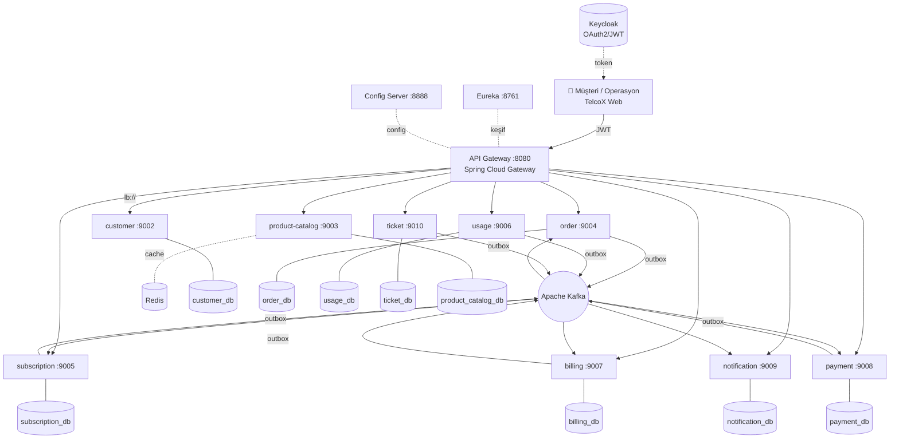
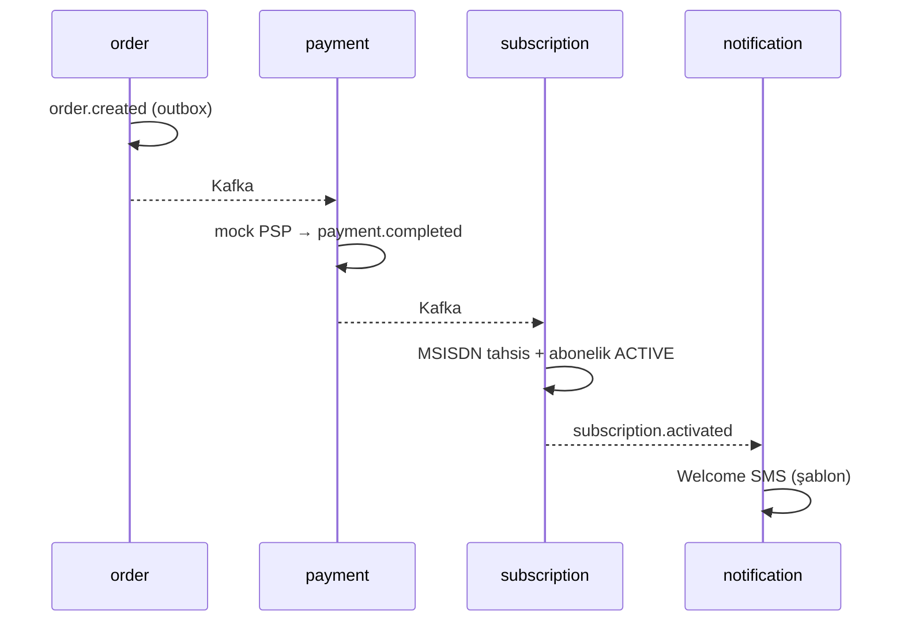

<div align="center">

# 🎤 TelcoX CRM — Jüri Sunum Dokümanı

### Turkcell "Geleceği Yazanlar" Bootcamp — 2026
**Mikroservis Tabanlı Telekom CRM Platformu**

Ekip: **Aymina Çakır · Mervenur Küçükkara · Nasrulla Emin**

</div>

---

## 1. Tek Bakışta Proje

TelcoX, hayali bir GSM operatörünün **müşteri yaşam döngüsünü uçtan uca** yöneten,
**event-driven** ve **database-per-service** prensipleriyle kurulmuş bir mikroservis
platformudur. Bir abonenin kaydından (KYC) siparişe, ödemeden abonelik aktivasyonuna,
kullanım (CDR) takibinden faturaya ve destek taleplerine kadar tüm akış **9 iş servisi**
ve **3 altyapı servisi** üzerinden yürür.

| | |
|---|---|
| **Mikroservis** | 9 iş + 3 altyapı (gateway, Eureka, config-server) |
| **Dil / Framework** | Java 21 · Spring Boot 3.4 · Spring Cloud |
| **Veri** | PostgreSQL 17 (servis başına şema) · Flyway · Redis 7 |
| **Mesajlaşma** | Apache Kafka 4.2 (KRaft) — Transactional Outbox |
| **Güvenlik** | Keycloak (OAuth2/JWT) · gateway + 9 servis resource-server · RBAC |
| **Dayanıklılık** | Resilience4j (circuit breaker/retry) · idempotency · outbox retry |
| **Arayüz** | Gerçek backend'e bağlı web (müşteri portalı + operasyon konsolu) |
| **DevOps** | Docker Compose · GitHub Actions CI · Kubernetes + HPA örneği |
| **Kapsam** | Dokümandaki **33 fonksiyonel gereksinimin tamamı** + spec üstü işler |

---

## 2. Neden Mikroservis? Tasarım İlkeleri

| İlke | Uygulama |
|---|---|
| **Database per service** | Her servis yalnız kendi şemasına erişir; servisler arası **FK yok**, sadece ID referansı |
| **Loose coupling** | Senkron REST **yalnız gerektiğinde** (Feign); asıl entegrasyon **asenkron Kafka** |
| **Bounded context (DDD)** | Her servis net bir domaine sahip (Müşteri, Katalog, Sipariş, …) |
| **Atomicity** | DB + event yayınını **Transactional Outbox** ile atomik hale getirdik |
| **Resilience** | Servis çökse bile sistem ayakta: circuit breaker, retry, idempotency |

---

## 3. Sistem Mimarisi



- **Gateway** tek giriş noktası; JWT'yi doğrular, `lb://servis-adı` ile Eureka üzerinden yönlendirir. Web arayüzü de gateway'in `static/` klasöründen servis edilir → **tek origin, CORS yok**.
- **Config-server** ortak konfigürasyonu Git'ten dağıtır; **Eureka** servis keşfini sağlar.
- Servisler arası **asıl iletişim Kafka**; senkron gereken yerde (ör. order → customer doğrulama) **Feign + JWT relay**.

---

## 4. Mikroservisler ve Sorumluluklar

| Servis | Port | Domain | Geliştirici |
|---|---|---|---|
| customer-service | 9002 | Müşteri, adres, KYC belgesi, PII şifreleme | **Aymina** |
| order-service | 9004 | Sipariş + **Saga orchestration** | **Aymina** |
| subscription-service | 9005 | Abonelik state machine, MSISDN havuzu, SIM | **Aymina** |
| billing-service | 9007 | Bill-run, fatura üretimi, **PDF** | **Mervenur** |
| payment-service | 9008 | Mock PSP, ödeme, retry, cüzdan, idempotency | **Mervenur** |
| usage-service | 9006 | Kota, CDR tüketimi, **kota aşımı bildirimleri** | **Mervenur** |
| product-catalog-service | 9003 | Tarife/addon katalog, **versiyonlama, Redis cache** | **Nasrulla** |
| notification-service | 9009 | SMS/e-posta/push, **şablon yönetimi** | **Nasrulla** |
| ticket-service | 9010 | Destek talebi, **SLA + otomatik ekip atama** | **Nasrulla** |
| gateway / eureka / config | 8080/8761/8888 | Altyapı — **ortak** | Ekip |

---

## 5. Kilit Mimari Desenler (kodla)

### 5.1 Transactional Outbox — "event kaybı yok"
İş verisi ile event, **aynı DB transaction'ında** yazılır; ayrı bir publisher Kafka'ya atar. FAILED event'ler retry ile yeniden denenir.

```java
// subscription-service: abonelik aktive olurken outbox'a event de yazılır (atomik)
Subscription saved = subscriptionRepository.save(subscription);
OutboxEvent outboxEvent = new OutboxEvent();
outboxEvent.setAggregateType("SUBSCRIPTION");
outboxEvent.setEventType("SubscriptionActivated");
outboxEvent.setPayload(objectMapper.writeValueAsString(activatedEvent));
outboxEvent.setStatus(OutboxStatus.PENDING);
outboxEventRepository.save(outboxEvent);   // <-- aynı transaction
```

### 5.2 Saga — dağıtık işlem koordinasyonu
`order.created → payment → payment.completed → subscription.activated`. Ödeme başarısız olursa (`payment.failed`) abonelik **askıya alınır** (kompansasyon).



### 5.3 Idempotency — "çift işleme yok"
Her tüketici, işlediği event id'sini `processed_events` tablosuna yazar; tekrar gelen event atlanır.

```java
if (processedEventRepository.existsById(event.eventId())) {
    LOGGER.info("PaymentCompleted zaten işlendi eventId={}", event.eventId());
    return;   // idempotent
}
```

### 5.4 Kota eşiği + aşım (usage-service)
CDR geldikçe kota azalır; **%80** eşiğinde `QuotaThresholdReached`, **%100**'de `QuotaExceeded`, aşım `UsageAggregated` ile **billing'e** gider. Event `customerId` taşır → bildirim doğru kişiye ulaşır.

---

## 6. Güvenlik

- **Keycloak** realm `telco-crm` **otomatik import** edilir (`docker/keycloak/`); kullanıcılar: `ops` (ADMIN), `elif.aydin` (USER).
- **Gateway + 9 servisin tamamı** OAuth2 **resource-server**: JWT imzası Keycloak JWKS ile doğrulanır.
- **RBAC** canlı: `@PreAuthorize("hasRole('ADMIN')")` — tarife oluşturma, bill-run, KYC onayı yalnız ADMIN; USER admin uçlarında **403** alır.
- Servisler arası çağrıda **Feign RequestInterceptor** gelen `Authorization` başlığını taşır (saga içi doğrulama).
- Müşteri kimlik verisinde **PII şifreleme**.

---

## 7. Web Arayüzü (gerçek veri)

**Müşteri Portalı** — telefon/ad/kullanıcı adı ile giriş; ana sayfa kotaları, **paket değiştirince kota gerçekten güncellenir**, fatura detay + PDF, gerçek talep açma, profil düzenleme, kota düşünce **paket önerisi**.

**Operasyon Konsolu** — Dashboard/Müşteriler/Ürünler/Siparişler/Faturalama/Ticket Center **gerçek API**; Ticket Center'da tüm talepler + **otomatik atanan ekip**; Monitoring'de gerçek servis sağlığı (`/ops/health`).

> Servis UP/DOWN **gerçektir**; CPU/pod/HPA görselleri Prometheus olmadığından simülasyondur (rapora "tam metrik entegrasyonu gelecek çalışma" notu düşülür).

---

## 8. Kabul Senaryoları — Uçtan Uca Test Sonuçları ✅

Gerçek servisler üzerinde çalıştırıldı (komutlar: `docs/KABUL_TESTLERI.md`):

| # | Senaryo | Doğrulanan |
|---|---|---|
| 14.1 | Onboarding | Abonelik **ACTIVE** + MSISDN atandı + welcome SMS `SENT` |
| 14.2 | Aylık Fatura | bill-run → fatura + **PDF 200** + `INVOICE_GENERATED` e-posta → ödeme → **PAID** |
| 14.3 | Kota Aşımı | %80 + %100 **SMS SENT** + overage `UsageAggregated` billing'e |

Ayrıca: birim testleri (Mockito), **GitHub Actions CI** her push'ta build+test.

---

## 9. DevOps

- **Docker Compose**: Kafka, 9× PostgreSQL, Redis, Keycloak — tek komut (`docker compose up -d`).
- **Scriptler**: `run-all.sh` / `stop-all.sh` / `status.sh` / `seed-demo-data.sh`.
- **CI**: `.github/workflows/ci.yml` — build + test.
- **Kubernetes**: `k8s/product-catalog/` — Deployment + **HPA (yatay ölçekleme)** + Redis + README (kind ile çalıştırma).

---

## 10. Canlı Demo Akışı (5 dakika)

```bash
cd docker && docker compose up -d && cd ..     # 1) altyapı
./scripts/run-all.sh                            # 2) 12 servis (status.sh → 12/12)
./scripts/seed-demo-data.sh                     # 3) demo veri
# 4) http://localhost:8080/TelcoX.html
```

1. **Müşteri** (`elif.aydin`): Paket Değiştir → kota çubukları anında değişir; fatura PDF; talep aç.
2. **Operasyon** (`ops`): Ticket Center'da az önce açılan talep + atanan ekip; Monitoring canlı sağlık.
3. **Uçtan uca** (terminal): `docs/KABUL_TESTLERI.md` ile onboarding → fatura → kota aşımı.

---

## 11. Beklenti vs. Teslim

| Beklenen (MVP) | Teslim | Ekstra |
|---|---|---|
| 9 servis + gateway/eureka/config | ✅ | — |
| Database-per-service + Kafka | ✅ | Outbox + FAILED retry |
| Saga (onboarding) | ✅ | Kompansasyon (askıya alma) |
| JWT güvenlik | ✅ | **9 servisin tamamı** + canlı RBAC + Feign relay |
| 3 kabul senaryosu | ✅ | Uçtan uca **test edildi** + otomatik seed |
| — | ➕ | **Gerçek web arayüzü** (portal + ops konsolu) |
| — | ➕ | Redis cache · pagination · PDF · PII şifreleme |
| — | ➕ | Resilience4j · idempotency · **K8s + HPA** · CI |

---

## 12. Ekip Katkıları

| Geliştirici | Servisler | Öne çıkanlar |
|---|---|---|
| **Aymina Çakır** | customer · order · subscription | KYC + PII şifreleme; **Saga**; MSISDN/SIM lifecycle; Feign token interceptor |
| **Mervenur Küçükkara** | billing · payment · usage | bill-run + **PDF**; mock PSP + retry + **idempotency** + cüzdan; kota/CDR + aşım bildirimleri |
| **Nasrulla Emin** | product-catalog · notification · ticket | tarife **versiyonlama** + **Redis cache**; şablon bildirim; **SLA + otomatik ekip atama** |

**Ortak:** gateway, Eureka, config-server, Docker, CI, Keycloak, web arayüzü, kabul testleri.

---

## 13. Öğrenilenler & Gelecek Çalışma

- **Öğrenilenler:** dağıtık transaction'ın zorluğu (outbox/saga ile çözüldü), event-driven tasarımın gevşek bağ avantajı, JWT/RBAC ile uçtan uca güvenlik, servis keşfi ve config yönetimi.
- **Gelecek:** Prometheus + Grafana ile gerçek metrik/CPU/pod; Zipkin ile dağıtık trace; tüm servisler için tam K8s manifestleri; sözleşme testleri (contract testing).

<div align="center">

**TelcoX CRM** — *Turkcell Geleceği Yazanlar Bootcamp 2026*

</div>
